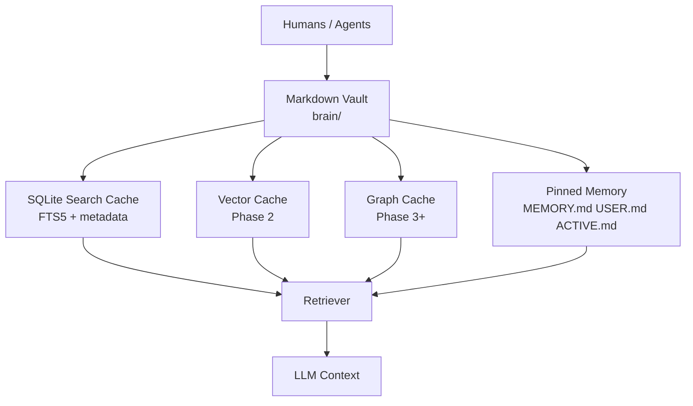
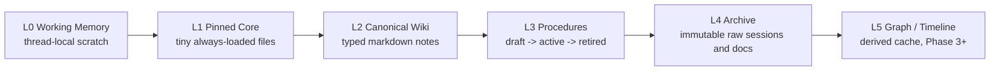
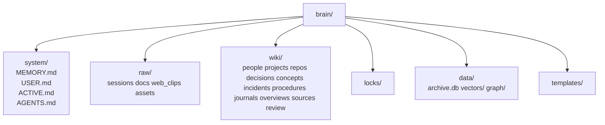
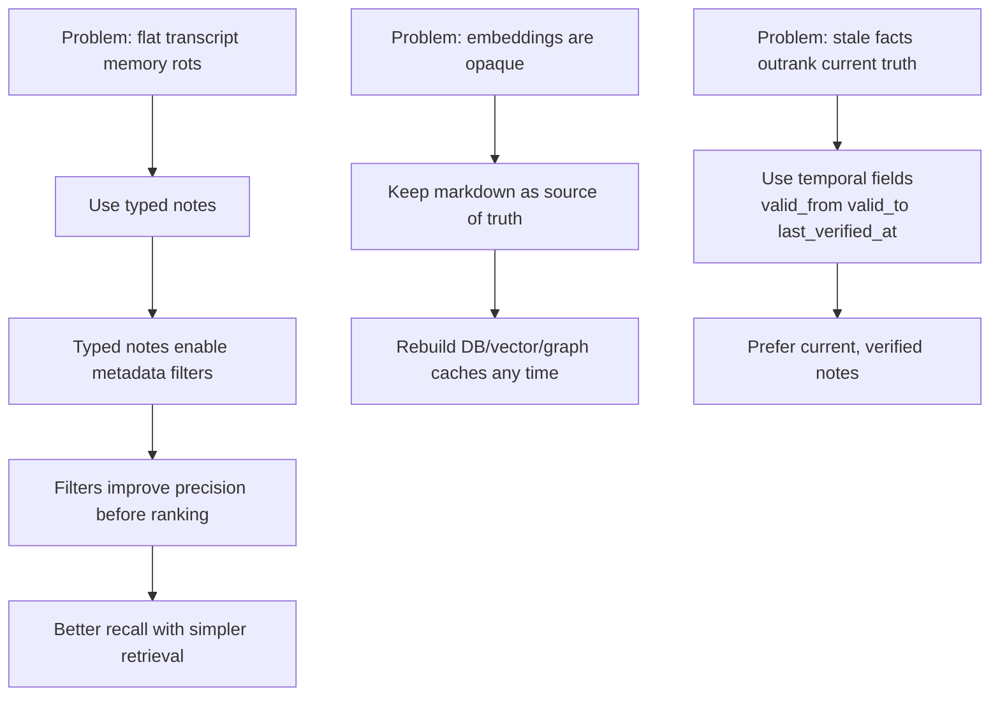
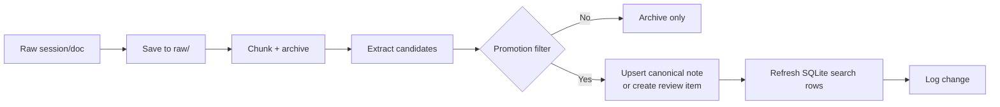
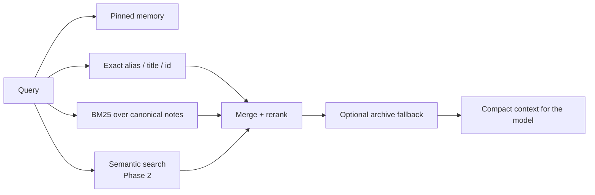
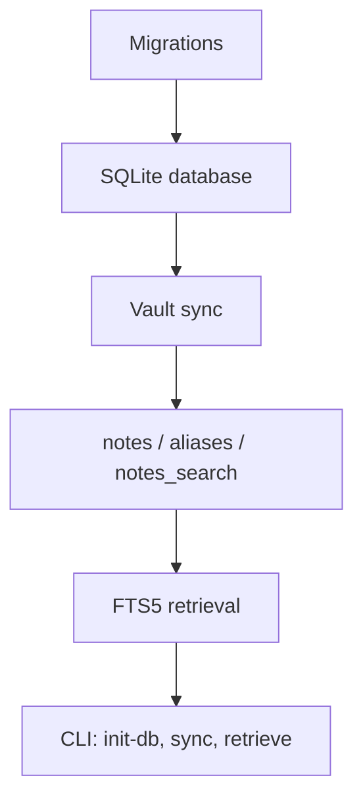

# MnemonicOS

MnemonicOS is a local-first memory system for Codex and Claude.

## Why This Design

The system is built around one rule: the markdown vault is the truth, and
everything else is a cache.

- Inspectable: humans can read and repair the vault directly.
- Portable: the full memory moves with git, not with a hosted DB.
- Recoverable: SQLite indexes, vectors, and future graph caches can be rebuilt.
- Conservative: write discipline matters more than retrieval cleverness.

## System Shape



## Memory Layers



- `L1` holds durable preferences, conventions, and active focus.
- `L2` is the main long-term memory: decisions, people, projects, concepts.
- `L3` stores reusable workflows, but only after review.
- `L4` preserves raw evidence and provenance.
- `L5` is optional and only added when evals justify it.

## Vault Structure



## Design Rationale



- Typed notes beat flat logs for recall and maintenance.
- Exact lookup plus BM25 is the Phase 1 baseline; semantic and graph layers are
  additive, not foundational.
- Procedures are gated because a bad workflow note poisons future behavior.
- Consolidation is a first-class service so duplicates and alias drift do not
  quietly degrade retrieval.

## Write Path



## Retrieval Path



Phase 1 implements the bold path here: pinned memory, exact lookup, and BM25.

## What Phase 1 Builds



- migration runner
- markdown frontmatter parser
- incremental vault sync into SQLite
- exact alias/title/id retrieval
- BM25 retrieval over canonical notes

## Running Phase 1

If installed as a package:

```bash
mnemonicos init-db
mnemonicos sync --mode full
mnemonicos retrieve "why did we pick postgres for auth?"
```

Without installation, the current module path is still `second_brain`:

```bash
PYTHONPATH=src python3 -m second_brain init-db
PYTHONPATH=src python3 -m second_brain sync --mode full
PYTHONPATH=src python3 -m second_brain retrieve "why did we pick postgres for auth?"
```

Implementation details live in [docs/IMPLEMENTATION_PLAN.md](/Users/jianyulong/ai_memory/docs/IMPLEMENTATION_PLAN.md).
