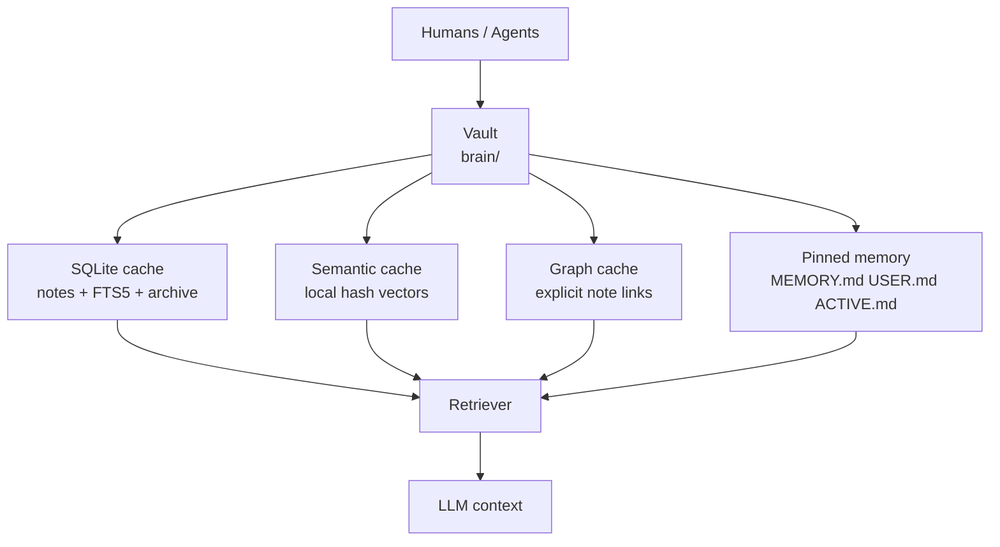
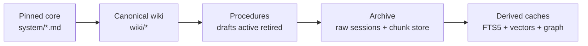
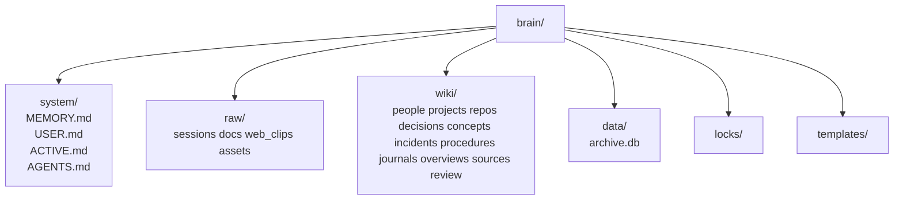
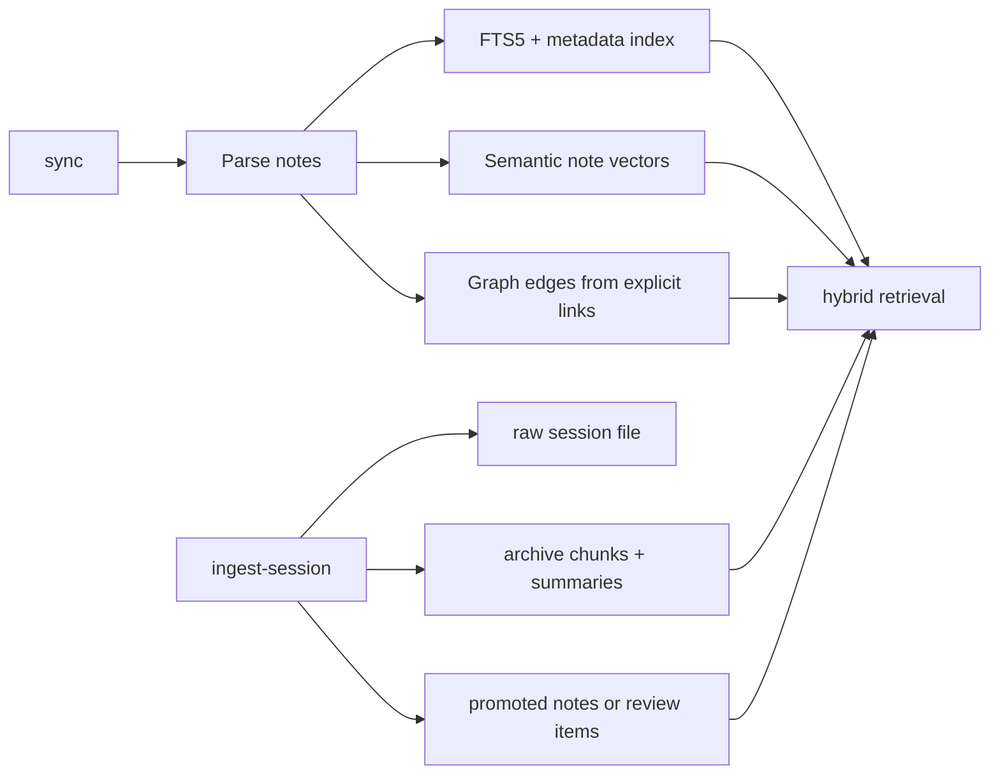
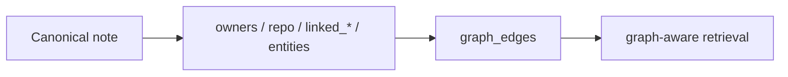
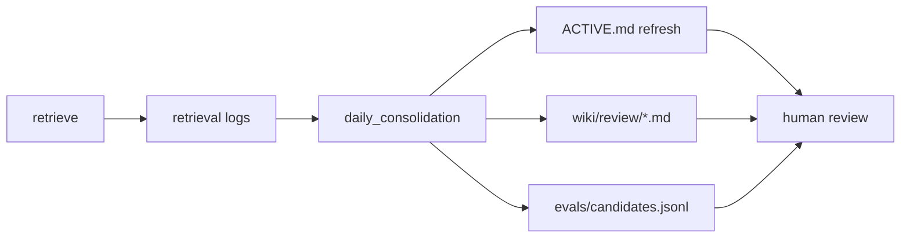
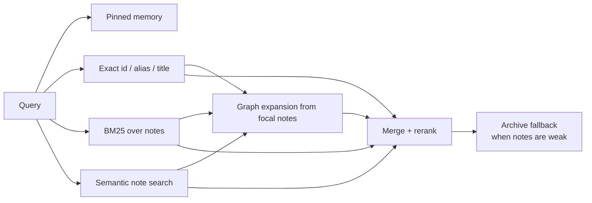
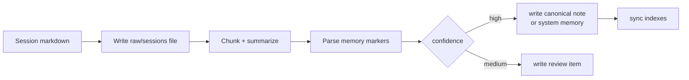

# MnemonicOS

MnemonicOS is a local-first memory system for Codex and Claude. The markdown
vault is the source of truth; SQLite search tables, semantic vectors, and the
note graph are rebuildable caches.

## Design



Why it is structured this way:

- Inspectable: every durable memory lives as markdown in `brain/`.
- Portable: git can move the whole system without a hosted backend.
- Recoverable: `archive.db`, vectors, and graph indexes can be rebuilt.
- Conservative: promotion rules matter more than fancy ranking.

## Memory Layout





## What Ships Today

Phase 3 is implemented.



- incremental vault sync into SQLite
- note summaries generated during sync
- local semantic retrieval channel using deterministic hashed vectors
- graph retrieval layer from explicit note relationships like `owners`, `repo`, and `linked_*`
- raw session ingest with archive chunking and chunk summaries
- explicit memory promotion into canonical notes
- review item generation for medium-confidence promotions
- maintenance jobs for duplicate aliases and stale active notes
- `ACTIVE.md` refresh from maintenance jobs, with review, stale, and eval backlog sections
- retrieval-miss mining into `evals/candidates.jsonl` for future labeling
- test coverage for Phase 1, Phase 2, Phase 2.5, and Phase 3 flows

## Graph Memory

Phase 3 adds a small, SQLite-backed note graph derived only from explicit
relationships already present in canonical note frontmatter.



- the graph is a cache, not a source of truth
- it is rebuilt during note sync, so direct vault edits stay authoritative
- it expands from the strongest focal notes instead of replacing BM25
- it helps with questions like “which decision does Sarah Chen own?” where the
  target note may not mention the owner in its body text

## Maintenance Loop

The system now closes the loop between retrieval quality and operator review.



- unresolved review items are summarized into `brain/system/ACTIVE.md`
- stale active decisions and procedures are surfaced with last verification dates
- zero-hit or archive-only retrievals become eval candidates automatically
- dry runs report predicted backlog without mutating the vault

## Retrieval



Current retrieval behavior:

- exact matches win immediately
- BM25 remains the primary retrieval backbone
- semantic retrieval is a second channel, not a replacement
- graph expansion pulls in related notes from explicit links
- archive chunk fallback is used when canonical notes are not enough

The built-in semantic encoder is intentionally simple and local. It gives
hybrid retrieval out of the box today and can later be replaced with a stronger
local embedding model without changing the vault format.

## Ingest

MnemonicOS ingests raw sessions first, then promotes only explicit or
high-confidence memories.



Supported Phase 2 memory markers:

````markdown
```memory
items:
  - type: decision
    title: Use PgBouncer for auth connection pooling
    body: PgBouncer will sit in front of Postgres to absorb spikes.
    tags: [auth, database]
    confidence: high
  - type: procedure
    title: Rotate auth deploy checklist
    steps:
      - Run smoke tests
      - Approve rollout
    confidence: medium
  - type: preference
    title: Prefer async PR reviews for infra changes
    confidence: high
```
````

- `high` confidence note items are written into `wiki/`
- `medium` confidence items become inspectable files in `wiki/review/`
- `preference` updates `USER.md`
- `convention` updates `MEMORY.md`
- procedures stay `draft` unless review metadata is present

## Quick Start

If installed as a package:

```bash
mnemonicos init-db
mnemonicos sync --mode full
mnemonicos ingest-session --agent codex --slug pairing --file ./notes/session.md
mnemonicos retrieve "how do we release the auth service?"
mnemonicos run-job daily_consolidation
mnemonicos run-job weekly_hygiene
```

Without installation:

```bash
PYTHONPATH=src python3 -m second_brain init-db
PYTHONPATH=src python3 -m second_brain sync --mode full
PYTHONPATH=src python3 -m second_brain ingest-session --agent codex --slug pairing --file ./notes/session.md
PYTHONPATH=src python3 -m second_brain retrieve "how do we release the auth service?"
PYTHONPATH=src python3 -m second_brain run-job daily_consolidation
PYTHONPATH=src python3 -m second_brain run-job weekly_hygiene
```

`run-job daily_consolidation` now refreshes `brain/system/ACTIVE.md` and appends retrieval misses to `evals/candidates.jsonl` on live runs.

## Repo Map

- [docs/IMPLEMENTATION_PLAN.md](/Users/jianyulong/ai_memory/docs/IMPLEMENTATION_PLAN.md): build notes and architecture details
- [migrations/001_initial_schema.sql](/Users/jianyulong/ai_memory/migrations/001_initial_schema.sql): Phase 1 schema
- [migrations/002_phase2_semantic_and_ingest.sql](/Users/jianyulong/ai_memory/migrations/002_phase2_semantic_and_ingest.sql): Phase 2 schema
- [migrations/003_phase3_graph_cache.sql](/Users/jianyulong/ai_memory/migrations/003_phase3_graph_cache.sql): Phase 3 graph schema
- [src/second_brain/cli.py](/Users/jianyulong/ai_memory/src/second_brain/cli.py): entry points
- [src/second_brain/ingest.py](/Users/jianyulong/ai_memory/src/second_brain/ingest.py): raw session ingest and promotion
- [src/second_brain/retrieval.py](/Users/jianyulong/ai_memory/src/second_brain/retrieval.py): hybrid retrieval
- [src/second_brain/graph.py](/Users/jianyulong/ai_memory/src/second_brain/graph.py): note graph materialization and expansion
- [src/second_brain/jobs.py](/Users/jianyulong/ai_memory/src/second_brain/jobs.py): maintenance jobs
- [src/second_brain/ops.py](/Users/jianyulong/ai_memory/src/second_brain/ops.py): `ACTIVE.md` refresh and eval candidate ops
